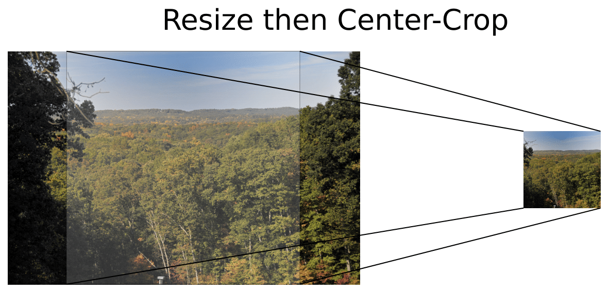

# Resize Images using PyTorch


This package allows resizing images with high throughput from the command line using PyTorch. 

## Dependencies

- Python 3.4++
- torch 1.0.0++
- Pillow 2.7++

## Installation

Install torch-resize-images using pip:

```
pip install torch-resize-images
```

## Usage

Given images in some `<input_dir>`, the following line first resizes and then center-crops all 
images to the size 224x224. 

```
torch-resize -r <input_dir> -o <output_dir> --width 224 --height 224
```

You can speed up processing by running multiple processes in parallel using the `-n` flag.
This defaults to 1 and is limited by your system memory. 

```
torch-resize -r <input_dir> -o <output_dir> --width 224 --height 224 -n 8
```

For more parameters and their explanation run the following line. 

```
torch-resize -h
```


## Example

